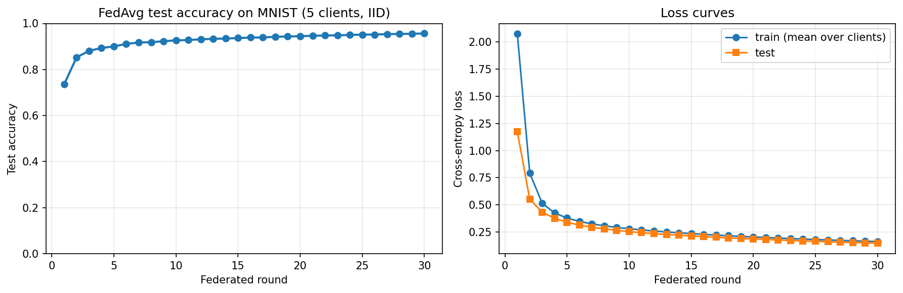
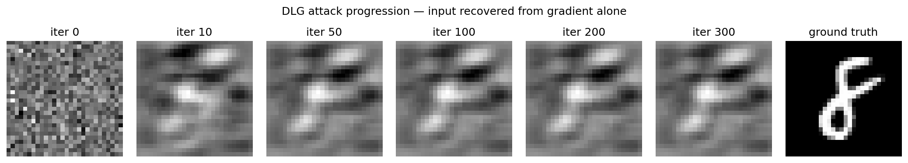
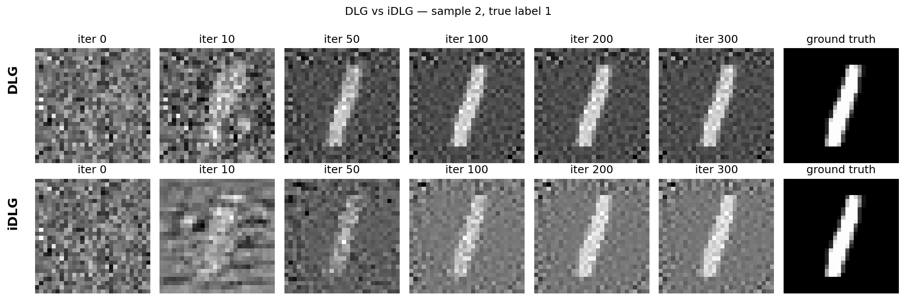
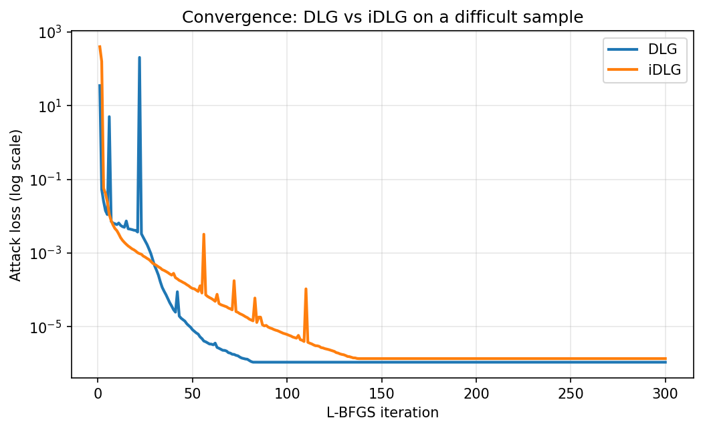
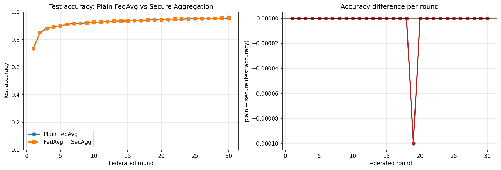
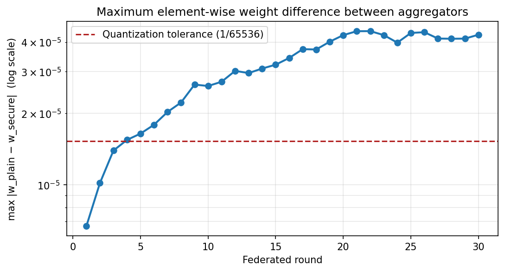
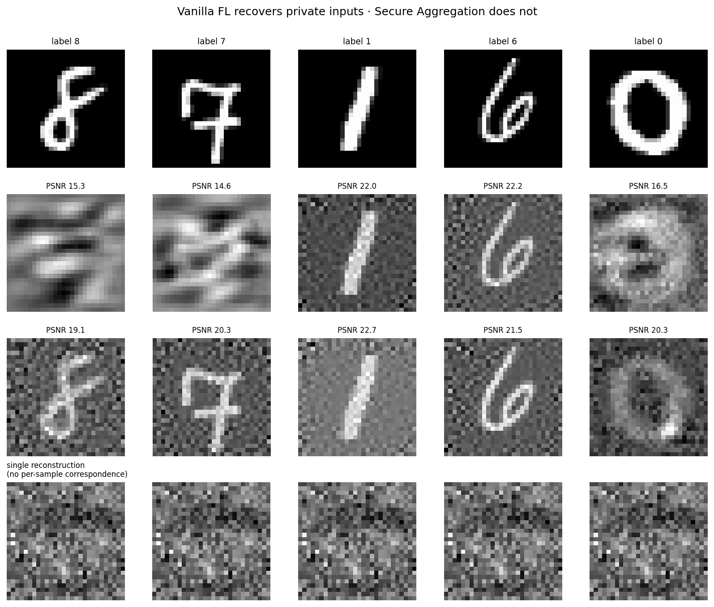
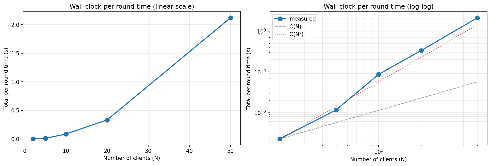
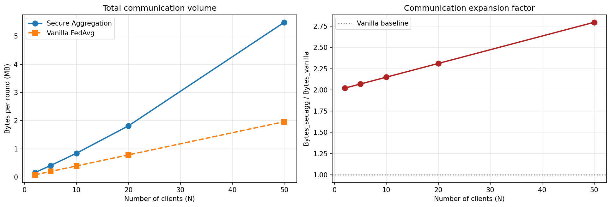
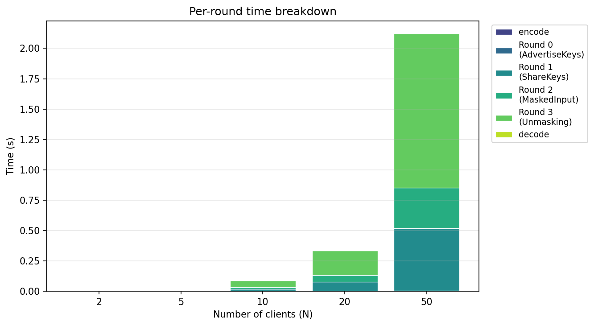

# Secure Aggregation vs. Gradient Leakage in Federated Learning

[](https://github.com/tahsinaydin02/secure-aggregation-fl/actions/workflows/tests.yml)
[](https://www.python.org/downloads/)
[](LICENSE)

A from-scratch implementation of two papers, run against each other:

- **the attack** — *Deep Leakage from Gradients* (Zhu, Liu & Han, NeurIPS 2019) and its
  improved variant **iDLG** (Zhao, Mopuri & Bilen, 2020), which reconstruct a client's
  private training image from nothing but the gradient it uploaded;
- **the defence** — *Practical Secure Aggregation for Privacy-Preserving Machine Learning*
  (Bonawitz et al., ACM CCS 2017), a four-round masking protocol that lets an untrusted
  server learn only the **sum** of client updates.

The claim under test: *"federated learning is private because we only share gradients, not
data."* It is not. And the fix costs essentially nothing in accuracy.

> Term project for **EE 575 — Network Security and Cryptography**, Spring 2026.
> All cryptography is implemented over standard primitives from `cryptography`
> (ECDH / AES-GCM / AES-CTR); Shamir secret sharing is implemented by hand.

---

## Headline results

| Question | Answer |
|---|---|
| Can a curious server recover a client's private image from one gradient? | **Yes** — iDLG recovers the correct label in **10/10** samples and converges in **8/10**, mean SSIM **0.51** |
| Does Secure Aggregation stop it? | **Yes** — the same attack on the aggregate of 5 clients collapses to SSIM **0.006** |
| What does the defence cost in accuracy? | **Nothing measurable** — 95.64 % vs 95.64 % test accuracy after 30 rounds; max weight divergence **3 × 10⁻⁵** (pure quantization noise) |
| What does it cost in resources? | **2.1 s** and **2.8× communication** at N = 50 clients (9 814-parameter model, single-machine simulation) |

---

## What is implemented

| Module | Contents |
|---|---|
| `src/model.py` | Small LeNet-style CNN (9 814 params). **Sigmoid + AvgPool**, deliberately — DLG differentiates *through* the gradient, so the network must be twice differentiable. ReLU/MaxPool break the attack for the wrong reason. |
| `src/data.py` | MNIST loading, IID and McMahan-style non-IID shard partitioning across clients. |
| `src/fl_baseline.py` | FedAvg (McMahan et al., Algorithm 1) written by hand — client-local SGD, weight-delta upload, server-side averaging, evaluation loop. |
| `src/dlg_attack.py` | DLG and iDLG. L-BFGS over a dummy input, minimising ‖∇W L(x′,y′) − g_target‖². Includes iDLG's analytic label recovery from the sign of the final-layer bias gradient, plus PSNR/SSIM reconstruction metrics. |
| `src/secure_agg/primitives.py` | Bonawitz §3 building blocks: ECDH over NIST P-256 + HKDF-SHA256, AES-256-GCM authenticated encryption, AES-CTR pseudorandom generator, and Shamir *t*-of-*n* secret sharing over GF(2⁵²¹ − 1) implemented from scratch (Horner evaluation, Lagrange interpolation, Fermat modular inverse). |
| `src/secure_agg/protocol.py` | The four-round protocol (Bonawitz Fig. 4, honest-but-curious variant): AdvertiseKeys → ShareKeys → MaskedInputCollection → Unmasking, with pairwise mask cancellation and **dropout recovery**. |
| `src/secure_agg/client_server.py` | Glue layer: fixed-point quantization of float32 deltas into ℤ_{2³²} (two's complement, scale 2¹⁶) so masked arithmetic works, then a drop-in `secure_federated_average` replacement for `federated_average`. |

The security invariant the protocol turns on is stated explicitly in `protocol.py`: for any
client *u*, the server may learn **either** the self-mask seed `b_u` **or** the pairwise
secret key `s_sk_u` — never both, because holding both is equivalent to holding `u`'s input.

---

## Repository layout

```
secure-aggregation-fl/
├── src/
│   ├── data.py                     # MNIST loading & federated partitioning
│   ├── model.py                    # twice-differentiable CNN
│   ├── fl_baseline.py              # FedAvg client/server            (Phase 1)
│   ├── dlg_attack.py               # DLG + iDLG gradient inversion   (Phase 2)
│   └── secure_agg/
│       ├── primitives.py           # ECDH, AES-GCM, AES-CTR PRG, Shamir SSS
│       ├── protocol.py             # Bonawitz 4-round pairwise masking
│       └── client_server.py        # quantization + FedAvg integration (Phase 3)
├── experiments/
│   ├── 01_baseline_fl.ipynb        # vanilla FedAvg baseline
│   ├── 02_dlg_attack_demo.ipynb    # DLG reconstruction of a private image
│   ├── 02b_idlg_comparison.ipynb   # DLG vs iDLG, 10 samples with restarts
│   ├── 03_secure_agg_correctness.ipynb  # protocol correctness + dropouts
│   ├── 04_dlg_vs_secure_agg.ipynb  # the attack, re-run against the defence
│   └── 05_overhead_scaling.ipynb   # time & bandwidth vs N
├── results/                        # every figure and CSV below, regenerated by the notebooks
├── tests/test_smoke.py             # pytest suite for the crypto and protocol layers
└── requirements.txt
```

Notebook outputs are committed on purpose, so the figures are visible without running anything.

---

## Setup

```bash
git clone https://github.com/tahsinaydin02/secure-aggregation-fl.git
cd secure-aggregation-fl

python3 -m venv .venv && source .venv/bin/activate
pip install --upgrade pip && pip install -r requirements.txt
```

Everything runs on CPU; MNIST downloads itself into `data/` on first use.

**Quick sanity check** (no dataset needed for the first two):

```bash
python -m src.secure_agg.primitives   # ECDH / AES-GCM / PRG / Shamir self-tests
python -m src.secure_agg.protocol     # 5-client end-to-end aggregation + dropout test
python -m src.model                   # architecture and parameter count
pytest -q                             # full smoke suite
```

Then open the notebooks in order and run top to bottom. Notebooks 02–05 expect
`results/phase1_final_state.pt`, which is committed, so they can be run standalone.

---

## Results

### Phase 1 — the baseline that gets attacked

Vanilla FedAvg, 5 clients, IID split, 1 local epoch per round, SGD lr = 0.05, 30 rounds.



Final: **95.64 %** test accuracy, test loss 0.1479. Sigmoid activations converge more slowly
than ReLU would — an accepted cost, since Phase 2 needs second derivatives to exist.

### Phase 2 — gradient inversion breaks the privacy claim

A single client's gradient is handed to the server, which optimises a noise image until its
gradient matches. Recognisable digits emerge within a few hundred L-BFGS iterations.



Plain DLG is unstable — it optimises the image and the label jointly, and in the first
unrestarted run **0/5** trials recovered the correct label (one trial diverged outright,
MSE ≈ 10²⁵). This instability is a real property of the method, not a bug, and it is exactly
what iDLG addresses.

### Phase 2b — iDLG: recover the label analytically, then only optimise the image

For a single sample under cross-entropy, ∂L/∂b_i = p_i − y_i, so the true class is the unique
negative entry of the final-layer bias gradient. No optimisation needed. With the label
pinned, the remaining search is far better behaved:

| Metric (10 samples, up to 5 restarts) | DLG | iDLG |
|---|---|---|
| Converged | 6/10 | **8/10** |
| Correct label | 7/10 | **10/10** |
| Mean PSNR (dB) | 19.59 | **20.47** |
| Mean SSIM | 0.374 | **0.509** |




### Phase 3a — Secure Aggregation is accuracy-neutral

Same seed, same data, same 30 rounds — the only change is that aggregation runs through the
Bonawitz protocol instead of a trusted sum.

| Round | Plain FedAvg | Secure Aggregation |
|---|---|---|
| 10 | 92.69 % | 92.69 % |
| 20 | 94.47 % | 94.47 % |
| 30 | **95.64 %** | **95.64 %** |




Maximum per-round weight divergence grows to ≈ 3 × 10⁻⁵ — consistent with the fixed-point
quantization step of 1/2¹⁶ ≈ 1.5 × 10⁻⁵ and nothing else. The protocol is exact; only the
float→integer encoding loses anything.

### Phase 3b — the same attack, now against the defence

| Attack | Target | Converged | Mean PSNR (dB) | Mean SSIM |
|---|---|---|---|---|
| DLG | vanilla FL, single gradient | 3/5 | 18.13 | 0.304 |
| iDLG | vanilla FL, single gradient | 5/5 | 20.77 | **0.616** |
| DLG | Secure Aggregation, sum of 5 | 0/1 | 18.85 | 0.062 |
| iDLG | Secure Aggregation, sum of 5 | 0/1 | 14.53 | **0.006** |



Structural similarity falls by two orders of magnitude. Note that PSNR barely moves — a good
illustration of why PSNR alone is a poor metric for this threat model: a bland grey image
scores respectably while containing no recoverable structure at all.

### Phase 3c — what the protocol costs

Wall-clock and bandwidth for one aggregation round over the 9 814-parameter model, averaged
over repeated trials.

| N clients | Total time (s) | SecAgg (MB) | Vanilla (MB) | Expansion |
|---|---|---|---|---|
| 2 | 0.002 | 0.16 | 0.08 | 2.02× |
| 5 | 0.012 | 0.41 | 0.20 | 2.07× |
| 10 | 0.087 | 0.84 | 0.39 | 2.15× |
| 20 | 0.333 | 1.81 | 0.79 | 2.31× |
| 50 | 2.121 | 5.49 | 1.96 | 2.80× |





Time grows super-linearly because each client performs O(N) ECDH agreements and the server
performs O(N²) work in the unmasking round — the known quadratic cost that SecAgg+ and later
protocols fix with sparse communication graphs. Communication expansion stays near 2× because
the masked vector dominates; key and share traffic is small at this model size.

---

## Deliberate design decisions

Each of these is argued in the corresponding module docstring:

- **Sigmoid + AvgPool instead of ReLU + MaxPool.** DLG's objective contains a gradient, so the
  optimiser needs second derivatives. ReLU's second derivative is undefined at 0 and PyTorch
  silently returns 0, which corrupts the landscape. Following the DLG paper here means the
  attack is evaluated on its own terms.
- **FedAvg written by hand rather than with Flower.** Phase 2 needs to intercept the per-client
  update at the server, and Phase 3 replaces the aggregation step entirely; both are awkward
  through a strategy abstraction. The loop is ~40 lines and reading it beats reading a class
  hierarchy. Flower would be the right call for a distributed or large-scale run.
- **Shamir secret sharing implemented from scratch, everything else from `cryptography`.**
  Rolling your own AES is the cardinal sin of applied cryptography. SSS is not packaged
  consistently in mainstream Python crypto libraries, and implementing it makes the field
  arithmetic auditable.
- **AES-CTR as the PRG, never `random`.** Python's Mersenne Twister is not cryptographically
  secure — its state is recoverable from a few hundred outputs, which would let an observer
  who saw part of a mask reconstruct the rest.
- **Two separate cross-entropy formulations.** The victim's gradient uses a one-hot
  *probability* target; the DLG dummy label is a learnable *logit* tensor that must be
  softmaxed. Conflating them was a real bug during development: it fuzzes the one-hot target
  and makes iDLG's bias-sign label recovery fail completely. Both functions and the reasoning
  are kept in `dlg_attack.py`.

## Known limitations

- **Honest-but-curious only.** Bonawitz §3.5–3.6 (signatures, PKI) and the Round 3 consistency
  check are not implemented; those are needed for the active-adversary variant, where a
  malicious server can otherwise lie about who dropped out.
- **Uniform averaging only.** Masks cancel only when every client enters the sum with the same
  coefficient, so sample-weighted FedAvg is not supported. This matches weighted averaging for
  the equal-size IID partition used here, but is a real restriction for non-IID deployments.
- **Single-sample attacks.** Batched gradient inversion needs the sample-by-sample update rule
  from the DLG paper; iDLG's analytic label recovery is provably batch-size-1 only, since the
  bias gradient sums over the batch and loses per-sample sign information.
- **Simulated, not distributed.** All clients run in one process. Timings measure protocol
  compute, not network latency, and are indicative only.
- **Small model.** 9 814 parameters on MNIST. Gradient inversion becomes substantially harder
  on larger models and larger inputs; these results should not be read as an upper bound on
  what is recoverable in practice.

## References

1. H. B. McMahan et al. *Communication-Efficient Learning of Deep Networks from Decentralized
   Data.* AISTATS 2017.
2. L. Zhu, Z. Liu, S. Han. *Deep Leakage from Gradients.* NeurIPS 2019.
3. B. Zhao, K. R. Mopuri, H. Bilen. *iDLG: Improved Deep Leakage from Gradients.* arXiv:2001.02610, 2020.
4. K. Bonawitz et al. *Practical Secure Aggregation for Privacy-Preserving Machine Learning.*
   ACM CCS 2017.

## License

MIT — see [LICENSE](LICENSE).
